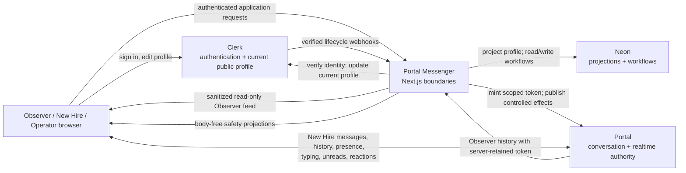
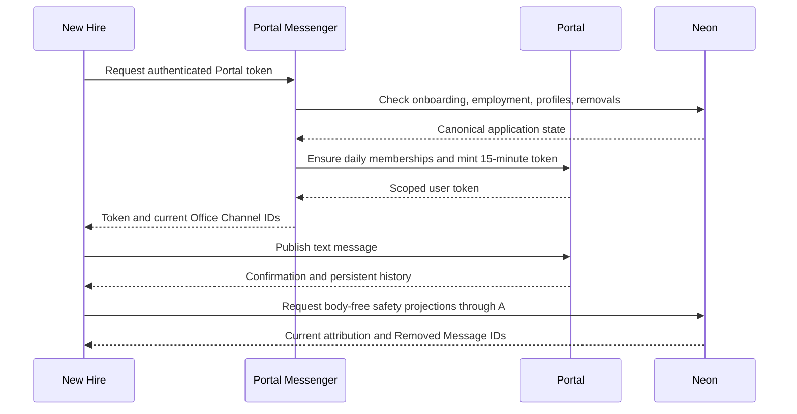

# Architecture and data flow

Portal Messenger deliberately divides authority rather than synchronizing the
same mutable state between services.

## Authority map

| Authority | Canonical state |
| --- | --- |
| Portal | Persistent messages and history, presence, typing, unread state, inbox state, reaction Office Events |
| Clerk | Authentication and each New Hire's current public name and picture |
| Neon | Current Clerk profile projection, onboarding, Office Days, outboxes, HR Reports, Removed Message projections, employment actions, Operator audits |

Neon never stores a message body, conversation history, presence, typing,
unread, or reaction projection. Portal messages retain only the stable Clerk
user ID needed to resolve current attribution. This avoids a message-body dual
write while allowing Neon-owned safety and application workflows to compose
with Portal history.

## Conversation read and write flow

The browser does not send a message body to Neon. A Removed Message records only
stable coordinates in Neon and causes the normal UI to render a tombstone; it
does not erase Portal storage.

Observers never connect to Portal directly. The application uses a server-only
Portal identity to fetch current-day history, composes it with Neon Removed
Message projections, and returns only the message ID, generic sender label,
timestamp, and validated text. Short polling provides near-live public reading
without giving an unauthenticated browser a credential that could publish.

## Profile flow

Clerk remains authoritative. An authenticated profile edit updates Clerk first.
A verified `user.created`, `user.updated`, or `user.deleted` webhook then
source-orders the current projection in Neon. Authenticated session repair uses
the same rule. Portal carries only a stable `profile.invalidated` hint, so
clients refetch Neon rather than trusting mutable profile data in an event.
Deletion tombstones the projection and historical messages resolve to
**Former Employee** with no picture.

## Office Event flow

One hidden daily Portal channel carries the versioned contract described in
[Office Event protocol](office-event-protocol.md). It uses the `v2` channel
namespace from the 2026-07-23 authorization-policy rollout onward.
Reaction changes are Portal-authoritative. Profile, report, removal, employment,
and Operator events are invalidation hints for Neon-owned queries. Reserved
senders and runtime validation prevent an ordinary New Hire from asserting
server state.

## Failure boundaries

- Signed-out requests stop at Clerk-backed server authentication.
- Portal offline state never falls back to browser-local conversation
  data in live mode.
- If Neon profile or Removed Message safety projections are unavailable, raw
  Portal history stays hidden until fresh projections can be read.
- Maintenance mode stops office API access and active rendering, but a Portal
  token already issued remains subject to Portal's 15-minute lifetime. Use
  Portal access controls as part of incident response.

These boundaries implement the decisions in [docs/adr](adr) without importing,
vendoring, running, linking as a prerequisite, or modifying private Portal
infrastructure.
